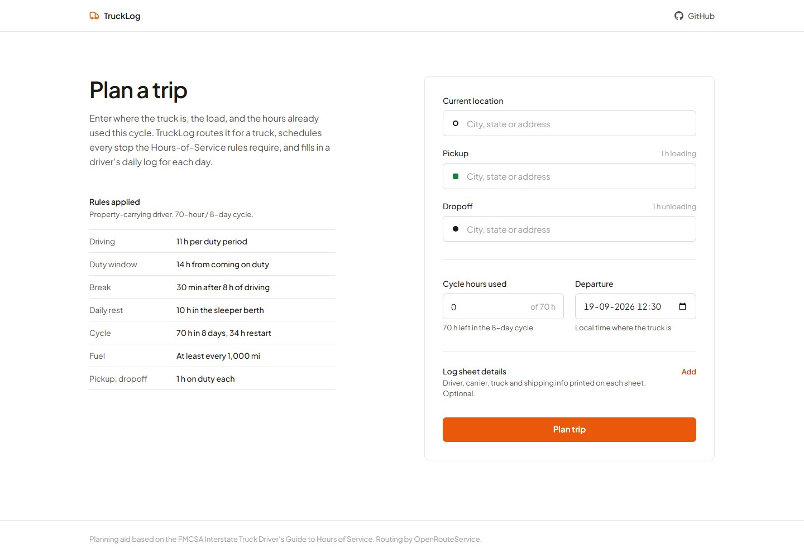
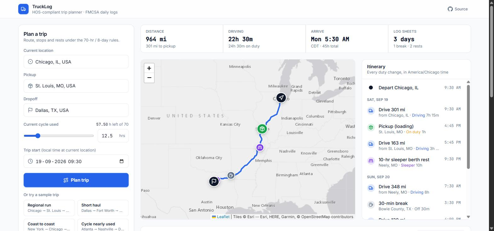
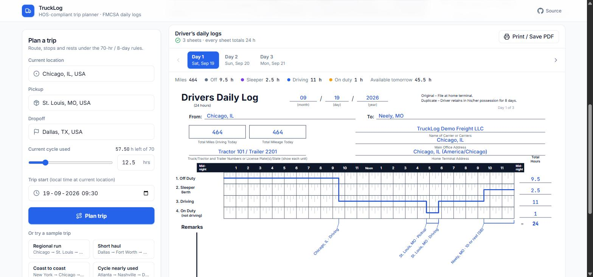

# TruckLog

**Plan a truck trip and get the route and the filled-in FMCSA daily log sheets, all within Hours-of-Service rules.**

**Live app:** https://trucklog-web.vercel.app · **API:** https://trucklog-api-pi.vercel.app/api/health

Enter where the truck is, the pickup, the dropoff and how many hours of the 70-hour cycle are already used. TruckLog routes the trip for a truck, places every fuel stop, 30-minute break, 10-hour rest and 34-hour restart where the rules require them, and draws a Driver's Daily Log for each calendar day of the trip.

| 1. Enter the trip | 2. Route and stops | 3. Daily logs |
|---|---|---|
|  |  |  |

The flow is one step at a time: **enter the trip → a short preloader while it's planned → a results workspace** with tabs for *Route and stops*, *Daily logs* and *How it's planned*. "Edit trip" goes back with everything filled in.

**Log sheet details.** Driver name, carrier, main office, home terminal, truck/trailer numbers, manifest number and shipper are entered by the user (in the form, or next to the sheets where they update live). Carrier, truck and driver are remembered in the browser for the next trip; shipping documents are per load. Nothing on a sheet is made up: an empty field prints as a blank line, like the paper form.

## What you get

- **Route map:** the truck route (OpenRouteService, heavy-goods-vehicle profile) with a marker and popup for every stop: pickup, dropoff, fuel, breaks, rests, restarts.
- **Trip summary:** distance, driving and on-duty hours, arrival time, number of log sheets, and warnings (such as a restart mid-trip).
- **Itinerary:** every duty change in order, grouped by day. Hovering an entry highlights its stop on the map.
- **Daily log sheets:** an SVG copy of the paper *Driver's Daily Log*: the 24-hour grid with the duty line, totals that always add up to 24, remarks with the place of every duty change, shipping documents, and the 70-hour/8-day recap. Print or save as PDF, one landscape sheet per page.
- **Shareable links:** every plan's inputs are kept in the URL, so "Share link" gives anyone the exact same trip, start time included.

## Hours-of-Service rules applied

Property-carrying driver, 70 hr / 8 days, no adverse conditions (FMCSA *Interstate Truck Driver's Guide to Hours of Service*, 2022):

| Rule | How the plan applies it |
|---|---|
| 11 hours driving after 10 hours off | 10-hour sleeper-berth rest when reached |
| 14-hour driving window | No driving after hour 14; on-duty work may finish past it |
| 30-minute break after 8 hours of driving | Off duty 30 min; a 30-min+ fuel stop, pickup or rest also counts |
| 70 hours on duty in 8 days | 34-hour restart, then the cycle resets to 0 |
| Fuel at least every 1,000 miles | 30 min on duty |
| Pickup and dropoff | 1 hour on duty each |

Every modeling choice is listed in the app ("How this plan was built") and in [`docs/HOS_RULES.md`](docs/HOS_RULES.md) §6. The notable ones:

- **15-minute grid:** planning uses 15-minute steps, like a paper log. Drive times round up and fuel stops come earlier, so every choice errs on the safe side.
- **Times:** shown in the home-terminal time zone (the current location's), as FMCSA requires.
- **Cycle hours:** hours already used are assumed not to roll off during the trip, since per-day history isn't given. This never undercounts.
- **Calendar days:** a single day can show more than 11 hours of driving when it spans two duty periods. That's legal, and the app says so.

## How it works

```
React (Vite, TS)  ──POST /api/trips/plan──►  Django + DRF (stateless)
  form · map · itinerary · log SVG             ├ geocode      OpenRouteService Pelias → Nominatim/Photon
                                               ├ route        OpenRouteService HGV    → OSRM
                                               ├ HOS engine   pure Python, minute-by-minute simulation
                                               ├ place names  reverse geocode each stop ("City, ST")
                                               └ log sheets   split at midnight, totals, remarks, recap
```

- The **backend owns all the rules** (`backend/trips/hos/`, pure Python with no Django or I/O). The frontend only draws what the API returns, so every number on a sheet comes from a single engine event.
- **Free providers with fallbacks:** if truck routing is down, car routing takes over and the app says so. The API key stays on the server; location search is proxied through the backend.
- **One error format** for everything: `{"error": {"code", "message", "fields"}}`, shown in the UI as a clear message with a Retry button.

## Tests

```bash
cd backend && pytest -q        # 34 tests
```

- **Hand-worked scenarios** (`docs/HOS_RULES.md` §5), checked to the minute: a basic two-day trip, a fuel stop, cycle exhaustion with a 34-h restart, and a pickup mid-shift.
- **Property tests (Hypothesis):** an independent log auditor, sharing no code with the engine, replays 900+ random trips and checks every rule. Every sheet must also total exactly 24 hours, and daily miles must add up to the route.
- **API tests** with every map provider mocked: the full response contract, validation, unknown locations, unroutable trips, and the fallback to OSRM.

## Run it locally

```bash
# API (Python 3.12+)
cd backend
python -m venv .venv && source .venv/bin/activate   # Windows Git Bash: .venv/Scripts/activate
pip install -r requirements-dev.txt
cp .env.example .env        # add a free key from https://openrouteservice.org/dev/#/signup
python manage.py runserver 8000

# Web app (Node 20+)
cd frontend
npm install
npm run dev                 # http://localhost:5173, proxies /api to :8000
```

**Deploys:** both apps run on Vercel and deploy on every push to `main` (the API from `backend/`, the web app from `frontend/`).

## Repo map

| Path | What's there |
|---|---|
| `backend/trips/hos/` | HOS engine (`engine.py`), daily log builder (`logsheets.py`) |
| `backend/trips/services/` | Geocoding, routing, stop placement, and the planner that ties them together |
| `frontend/src/features/` | `trip-form`, `route-map`, `itinerary`, `summary`, `eld-log` (the log sheet) |
| `docs/BUILD.md` | Product spec, API contract, UI spec, plan |
| `docs/HOS_RULES.md` | Engine spec, worked scenarios, decisions |
| `docs/TESTING.md` | Manual test guide: inputs, expected outputs, why each part matters |
| `CLAUDE.md` | Working agreement for AI-assisted development in this repo |
